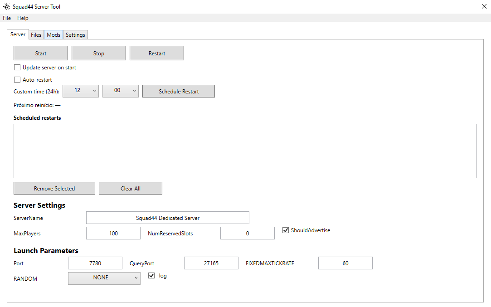
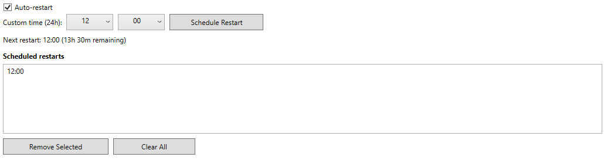
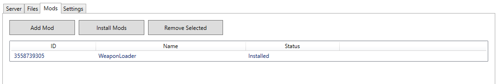
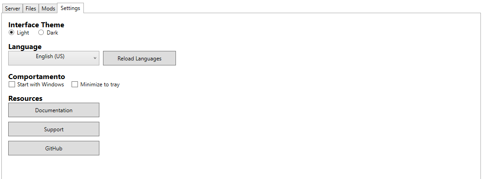

# Squad44 Server Tool - User Wiki

## 📋 Table of Contents
- [Overview](#overview)
- [Installation](#installation)
- [Main Interface](#main-interface)
- [Server Tab](#server-tab)
- [Files Tab](#files-tab)
- [Mods Tab](#mods-tab)
- [Settings Tab](#settings-tab)
- [Supported Languages](#supported-languages)
- [Update Check](#update-check)
- [Troubleshooting](#troubleshooting)

## 🎯 Overview

The Squad44 Server Tool is a comprehensive application to manage dedicated servers for Squad 44. With an intuitive interface and support for multiple languages, it allows you to control every aspect of your server simply and efficiently.

### Main Features
- ✅ Full server control (start, stop, restart)
- ✅ Automatic restart scheduling
- ✅ Mod management via Steam Workshop
- ✅ Automatic installation and updates via SteamCMD
- ✅ Interface in Portuguese, English, and Spanish
- ✅ Automatic update check
- ✅ Integrated console for monitoring

## 🚀 Installation

### System Requirements
- Windows 10/11 (64-bit)
- .NET 8.0 Runtime
- Internet connection
- At least 2GB of free disk space

### Installation Steps
1. Download the latest version from the [Releases page](https://github.com/DX-BR/Squad44ServerTool/releases)
2. Extract the ZIP file to a folder of your choice
3. Run `Squad44ServerTool.exe` as administrator
4. The application will automatically create the necessary folders

## 🖥️ Main Interface

The interface is divided into 4 main tabs:

### Top Menu
- **File**: Clear saved data and exit the application
- **Help**: Information about the program and update check

### Status Bar
- Displays the current application version
- Indicates the internet connection status

## 🎮 Server Tab

### Main Controls
- **Start**: Starts the dedicated server
- **Stop**: Stops the running server
- **Restart**: Restarts the server (stop + start)

### Configuration Options
- **Update server on start**: Checks for updates before starting
- **Auto-restart**: Enables automatic restart scheduling

### Server Settings
- **ServerName**: Name displayed in the server list
- **MaxPlayers**: Maximum number of players (default: 100)
- **NumReservedSlots**: Reserved slots for admins
- **ShouldAdvertise**: Makes the server publicly visible

### Startup Parameters
- **Port**: Main server port (default: 7780)
- **QueryPort**: Port for queries (default: 27165)
- **FIXEDMAXTICKRATE**: Server tick rate
- **RANDOM**: Randomness setting
- **-log**: Enables detailed logging

### Restart Scheduling

1. Check **Auto-restart**
2. Select the desired time (24h format)
3. Click **Schedule Restart**
4. The counter will show the remaining time until the next restart

**Tips:**
- You can schedule multiple times
- Use **Remove Selected** to delete a specific time
- Use **Clear All** to remove all schedules

## 📁 Files Tab

### SteamCMD and Server Installation

#### First Setup
1. Click **Download SteamCMD** (only needed once)
2. Wait for the download and automatic installation
3. Click **Install/Update Server**
4. The process may take 10-30 minutes depending on your connection

#### Regular Updates
- Use **Install/Update Server** to keep the server updated
- The process automatically checks for updates
- Use **Stop Task** to cancel an operation

#### Clean-Up and Maintenance
- **Delete SteamCMD**: Removes SteamCMD (you'll need to download it again)
- **Delete Server**: Completely removes server files
- **Delete Mods**: Removes all installed mods

### Monitoring Console
The console shows in real time:
- Status of operations
- Download progress
- Error messages
- Server logs

## 🔧 Mods Tab

### Mod Management

#### Adding Mods
1. Click **Add Mod**
2. Enter the Steam Workshop mod ID
3. The mod will appear in the list with status "Not Installed"

#### Installing Mods
1. Select the desired mods from the list
2. Click **Install Mods**
3. Wait for the download and installation

#### Removing Mods
- **Remove Selected**: Removes the selected mod from the list
- To uninstall: use **Delete Mods** in the Files tab

### Mod Status
- **Installed**: Mod downloaded and ready for use
- **Not Installed**: Mod is in the list but not downloaded

**Tip**: Find mod IDs in the Steam Workshop URL
- Example: `https://steamcommunity.com/sharedfiles/filedetails/?id=123456789`
- The ID is: `123456789`

## ⚙️ Settings Tab

### Interface Theme
- **Light**: Interface with light colors
- **Dark**: Interface with dark colors (default)

### Language
- **Portuguese (Brazil)**: Default language
- **English (US)**: English interface
- **Spanish (ES)**: Spanish interface

**Note**: Use **Reload Languages** if new translation files are added

### Behavior
- **Start with Windows**: Starts automatically with the system
- **Minimize to tray**: Minimizes to the notification area

### Features
- **Documentation**: Opens this guide
- **Discord**: Access to support server
- **GitHub**: Official project repository

## 🌍 Supported Languages

### Available Languages
- 🇧🇷 **Portuguese (Brazil)** - Complete
- 🇺🇸 **English (US)** - Complete  
- 🇪🇸 **Spanish (ES)** - Complete

### Changing Language
1. Go to **Settings** > **Language**
2. Select the desired language
3. The interface will update automatically

### Language Files
Translation files are in `languages/`:
- `pt-BR.json` - Portuguese
- `en-US.json` - English
- `es-ES.json` - Spanish

## 🔄 Update Check

### Manual Check
1. Go to **Help** > **Check for Update**
2. The system will check for the latest version on GitHub
3. If there's an update, the download page will open

### Update Process
1. Download the new version from the releases page
2. Close the current application
3. Replace the files with the new version
4. Your data and settings will be preserved

**Important**: The system does not automatically download updates for security reasons

## 🛠️ Troubleshooting

### Common Problems

#### "Internet connection error"
- Check your connection
- Temporarily disable antivirus/firewall
- Run as administrator

#### "SteamCMD not found"
- Use **Download SteamCMD** in the Files tab
- Check if it's not blocked by antivirus
- Run as administrator

#### "Server won't start"
- Check if the ports are open
- Confirm the server was installed properly
- Check the logs in the console

#### "Mods not loading"
- Ensure the mods are installed
- Verify the IDs are correct
- Reinstall mods if needed

### Logs and Diagnosis
- The integrated console shows real-time information
- Log files are in the server folder
- Use **Clear Data** for a complete reset (be careful!)

### Support
- 💬 **Discord**: Community support
- 🐛 **GitHub Issues**: Report bugs
- 📧 **Email**: Direct contact with developers

## 📝 Advanced Tips

### Performance Optimization
- Use SSD for better performance
- Set FIXEDMAXTICKRATE based on hardware
- Monitor CPU and RAM usage

### Backup and Security
- Regularly back up configurations
- Keep the server updated
- Use strong passwords for admin access

### Automation
- Set up automatic restarts
- Use custom scripts if necessary
- Regularly monitor logs

---

## 📞 Contact and Support

- **GitHub**: [Squad44ServerTool](https://github.com/DX-BR/Squad44ServerTool)
- **Discord**: [Squad44ServerTool](https://discord.gg/Mz5FHTUPgn)
- **Documentation**: Always updated version of this file

**Wiki Version**: 1.0  
**Last Update**: January 2025

---

*This guide is maintained by the community. Contributions are welcome!*

